# 6.Logistic-Regression
1. [Logistic Regression Theory and Reading](#schema1)
2. [Logistic Regression Code Along](#schema2)
3. [Logistic Regression Consulting Project](#schema3)

<hr>

<a name="schema1"></a>

## 1. Logistic Regression Theory and Reading
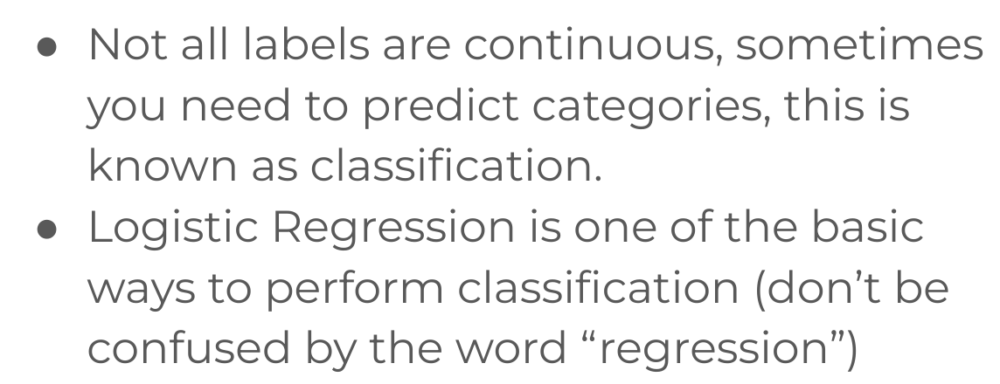

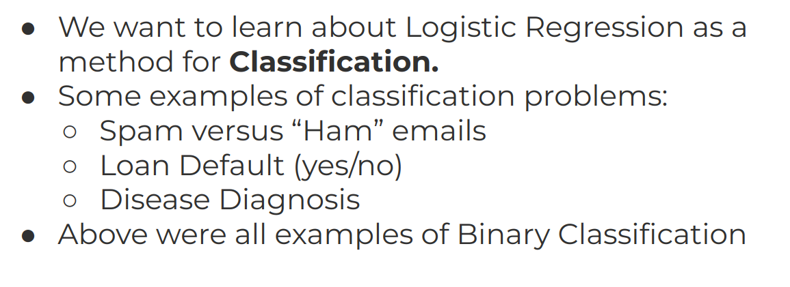
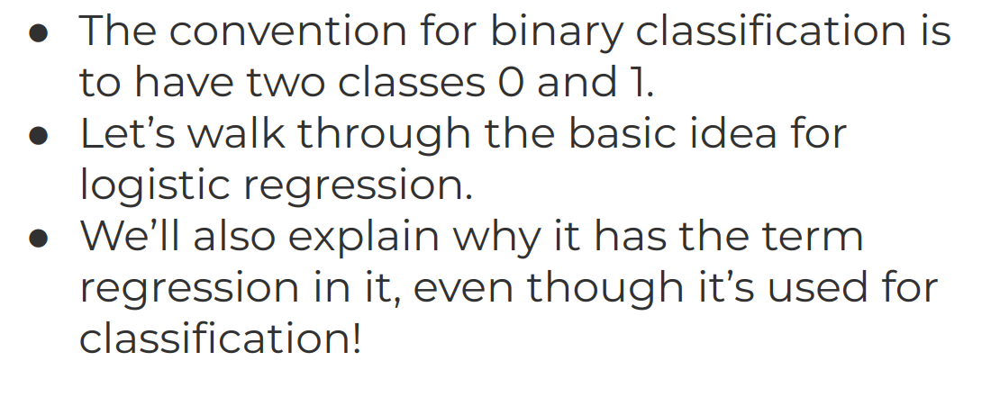
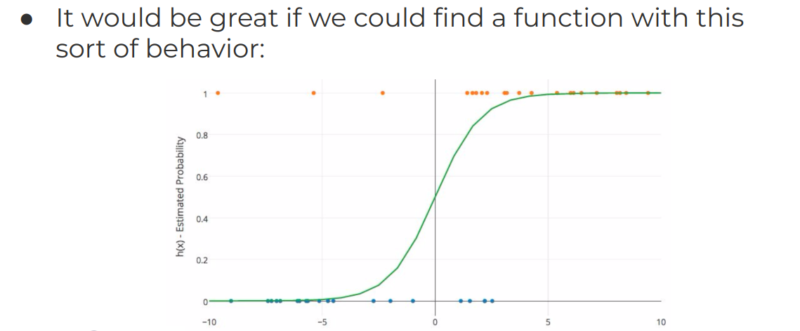
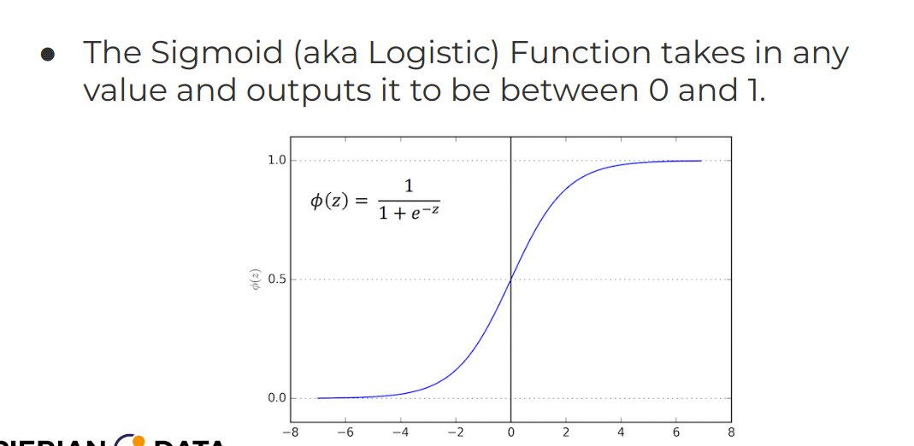
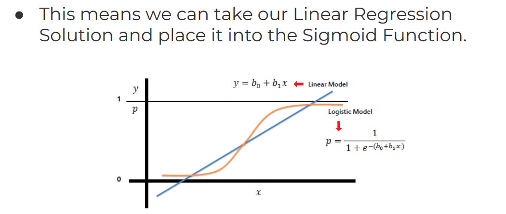

- Confusion Matrix
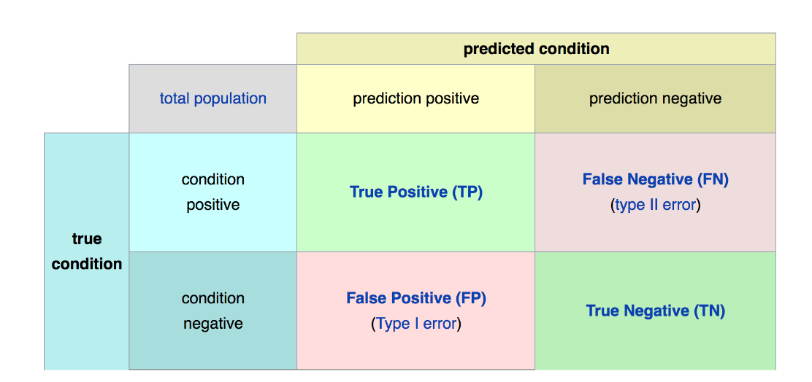
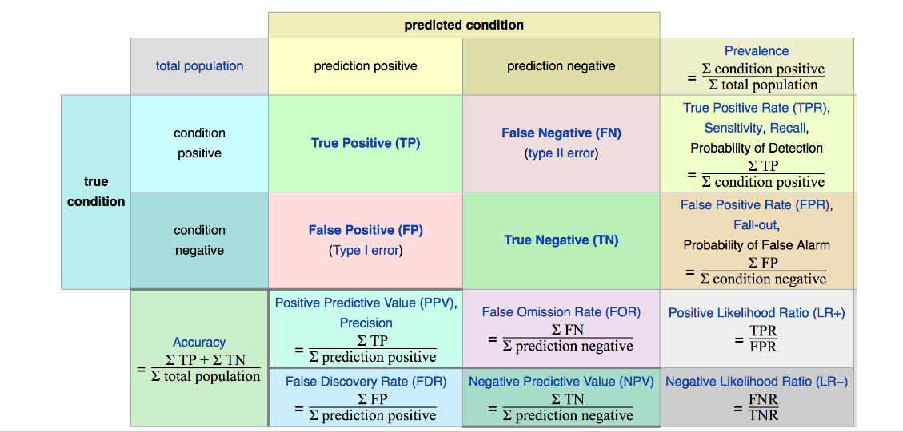
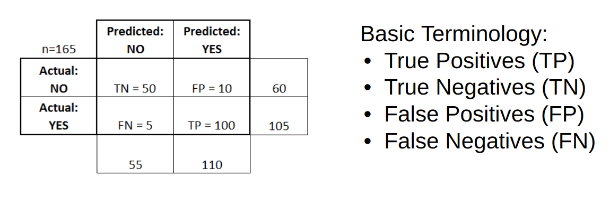
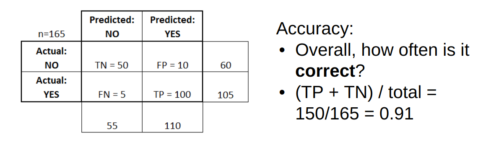
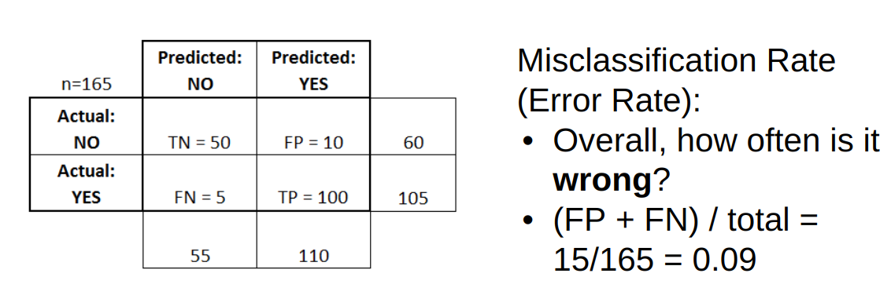
- Model Evaluation
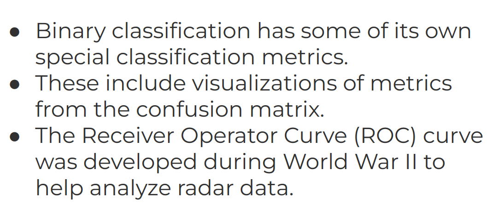
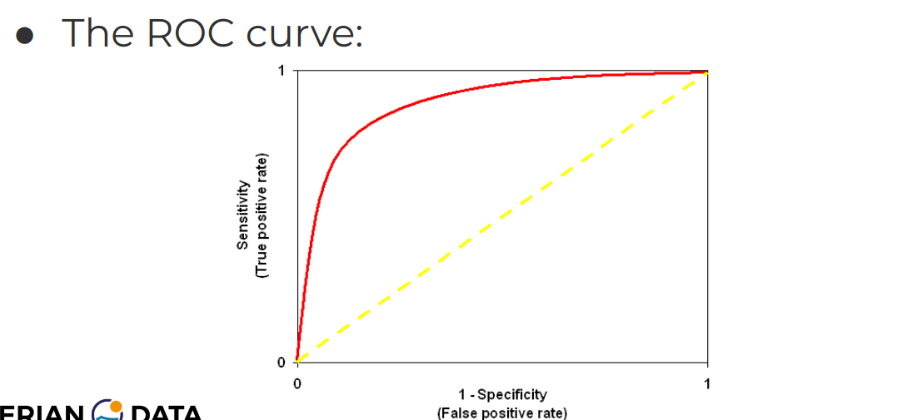


<hr>

<a name="schema2"></a>

## 2. Logistic Regression Code Along

### Categorical Columns 
- Seleccionamos columnas que vamos a usar 
```
 my_cols = df.select(['Survived','Pclass','Sex','Age','SibSp','Parch', 'Fare','Embarked'])
```
- Missing data    

```
my_final_data = my_cols.na.drop()
```
- Crear categorías númericas para categorías con string

```
from pyspark.ml.feature import (VectorAssembler,VectorIndexer,OneHotEncoder,StringIndexer)

gender_indexer = StringIndexer(inputCol='Sex',outputCol='SexIndex')
# A B C
# 0 1 2
# One hot encode
# example A
# [1, 0, 0]
gender_encoder = OneHotEncoder(inputCol='SexIndex', outputCol= 'SexVec')

embark_indexer = StringIndexer(inputCol='Embarked',outputCol='EmbarkIndex')
embark_encoder = OneHotEncoder(inputCol='EmbarkIndex',outputCol='EmbarkVec')
```

<hr>

<a name="schema3"></a>

## 3. Logistic Regression Consulting Project
### Logistic Regression Consulting Project
Binary Customer Churn
A marketing agency has many customers that use their service to produce ads for the client/customer websites. T
hey've noticed that they have quite a bit of churn in clients. They basically randomly assign account managers 
right now, but want you to create a machine learning model that will help predict which customers will churn 
(stop buying their service) so that they can correctly assign the customers most at risk to churn an account manager. 
Luckily they have some historical data, can you help them out? Create a classification algorithm that will help 
classify whether or not a customer churned. Then the company can test this against incoming data for future 
customers to predict which customers will churn and assign them an account manager.

The data is saved as customer_churn.csv. Here are the fields and their definitions:

Name : Name of the latest contact at Company
Age: Customer Age
Total_Purchase: Total Ads Purchased
Account_Manager: Binary 0=No manager, 1= Account manager assigned
Years: Totaly Years as a customer
Num_sites: Number of websites that use the service.
Onboard_date: Date that the name of the latest contact was onboarded
Location: Client HQ Address
Company: Name of Client Company
Once you've created the model and evaluated it, test out the model on some new data 
(you can think of this almost like a hold-out set) that your client has provided, saved under new_customers.csv. 
The client wants to know which customers are most likely to churn given this data (they don't have the label yet).


Logistic_Regression_Consulting_Project.ipynb